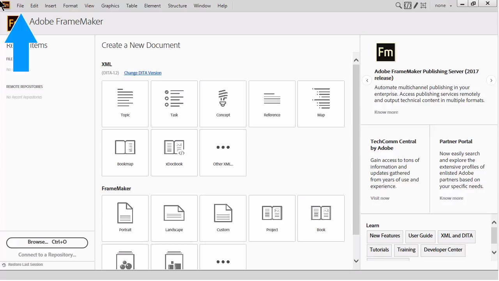
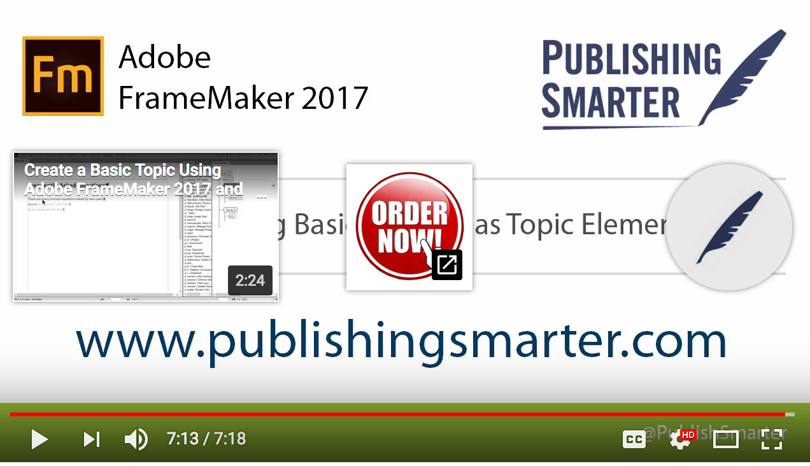
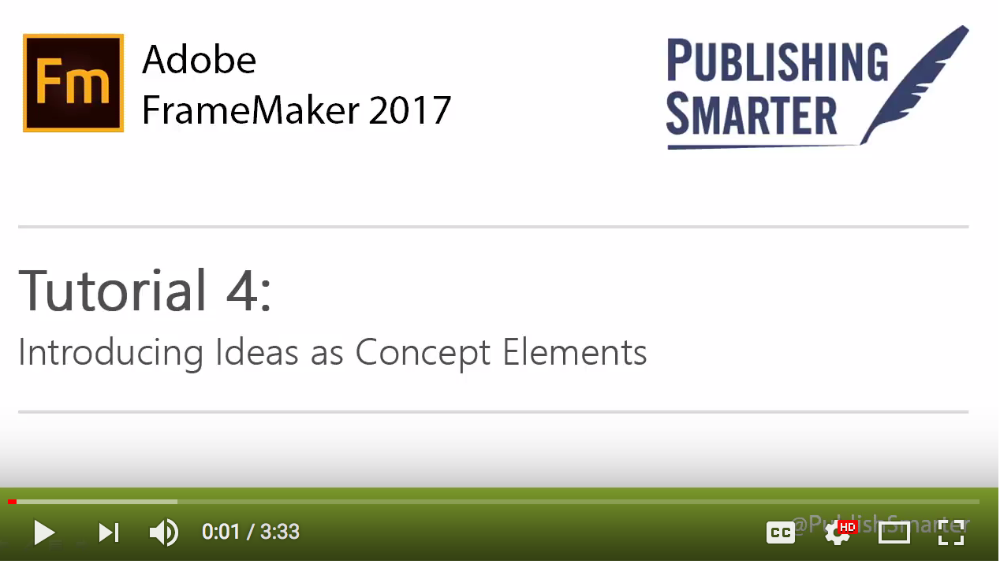
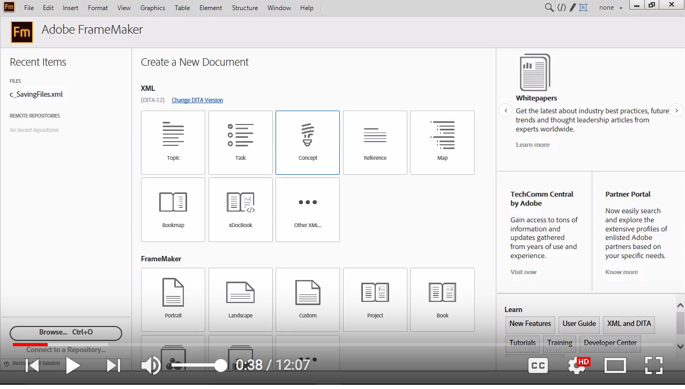
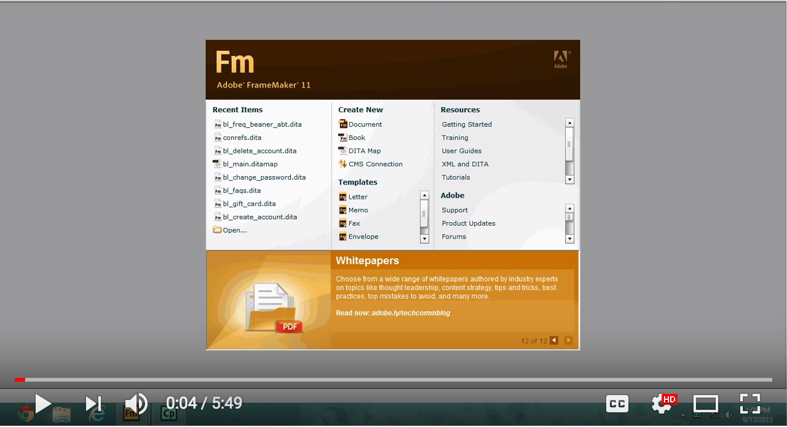

##{data-background="https://www.dita-ot.org/images/dita-logo.png" data-background-size="contain"}

<p class="rights">Bild: <https://www.dita-ot.org/> </p>

---

> - **D** arwin: Evolutionäre Weiterentwicklung
> - **I** nformation: Praktisch und mehrfach nutzbare Inhalte
> - **T** yping: Concept, Task, Reference als Grundtypen
> - **A** rchitecture: Komponenten für Wiederverwendung und Publikationen

<p class="rights">Orientiert an: [Sarah O'Keefe, DITA 101 webcast](https://www.youtube.com/watch?v=ngHIIWbEp_Q)</p>

## Zielsetzung

- Grundwissen über DITA
- Kenntnis von Anwendungsfällen und Business Cases
- Überlegungen zu DITA in der Content-Strategie

## Sehr gute Einführung

Sarah O'Keefe:

[DITA 101 - YouTube](https://www.youtube.com/watch?v=tBRyBYWGCqI)

[DITA 101](https://de.slideshare.net/Scriptorium/dita-101)

# DITA-Basics

## Warum DITA?

- Wiederverwendbarkeit von Inhalten

- Wiederverwendbarkeit von Modellen

- Trennung von Modell und Präsentation

- Orientierung an digitaler Ausgabe statt an papier-basierten Formaten

## Typische Vorteile

- die Veröffentlichung einer Menge von Informationsprodukten für unterschiedliche Benutzergruppen und über mehrere Releases hinweg unterstützen

- neue Zusammenstellungen von Inhalten einführen, die neue Inhaltstypen erfordern (z.B. Hardware Dokumentation, Geschäftsprozesse usw.)

<p class="rights">[Gnostyx DITA Demonstration Documents](https://github.com/dita-community/dita-demo-content-collection/tree/dita-1.3)</p>

## Wie funktioniert DITA?


##{data-background="https://help.adobe.com/en_US/framemaker/2017/using/assets/dita_fm.png" data-background-size="contain"}

<p class="rights">Bild: [Adobe Systems](https://help.adobe.com/en_US/framemaker/2017/using/index.html#t=using-framemaker-2017%2Ffrm_structauthdita_sd%2FDITA_maps-.htm) [](https://creativecommons.org/licenses/by-nc-sa/3.0/)</p>

<aside class="notes">

Die Hilfe zu Adobe Framemaker ist generell eine gute Einführung in DITA https://help.adobe.com/en_US/framemaker/2017/using/index.html

</aside>

## DITA Use Cases

[Freescale Semiconductor Inc](https://www.oxygenxml.com/case_study_Freescale_Semiconductor.html)

[Esko](https://componize.com/assessment-6-years-using-dita-esko/) ([Infografik](https://pbs.twimg.com/media/C6U9A4YXEAER9Pl.jpg:large))

[Skyward Case Study](http://go.easydita.com/skyward-case-study)

## Design-Prinzipien

- Minimalismus

- Information Mapping

- Vererbung/Objektorientierung

## Minimalismus

Nach JoAnn Hackos

> - Principle 1: Choose an action-oriented approach
> - Principle 2: Anchor the tool in the task domain
> - Principle 3: Support error recognition and recovery
> - Principle 4: Support reading to do, study, and locate

<p class="rights">Zitiert nach: [What is Minimalism? | Every Page is Page One](https://everypageispageone.com/2013/07/02/what-is-minimalism/ "What is Minimalism? | Every Page is Page One")</p>


---

> People are situated in a world more real to them than a series of steps, a world that provides rich context and convention for everything they do. People are always already trying things out, thinking things through, trying to relate what they already know to what is going on, recovering from errors. In a word, they are too busy learning to make much use of the instructions. (J.M.Carrol)

<p class="rights">[What is Minimalism? | Every Page is Page One](https://everypageispageone.com/2013/07/02/what-is-minimalism/ "What is Minimalism? | Every Page is Page One")</p>


## Information Mapping

Video: [Information Mapping - What is it? Why use it? - YouTube](https://www.youtube.com/watch?v=Fyj6txJR3g8)

---

> Information Mapping® provides a number of tools that help you to analyze, organize and present information:

>  Information Types [...]
>  Research-Based Principles [...]
>  Units of Information [...]
>  Presentation Modes [...]

Quelle: [The Information Mapping® Method - Information Mapping](https://www.informationmapping.com/en/?option=com_content&view=article&id=50&Itemid=400)


## Vererbung

{width=60%}

<p class="rights">Quelle: [Wikimedia Commons](https://commons.wikimedia.org/wiki/File:InheritancePgmExample.svg), Urheber: [User:Cactus26](https://commons.wikimedia.org/wiki/User:Cactus26), [](https://creativecommons.org/licenses/by-nc-sa/3.0/)</p>

---

> In object-oriented programming, inheritance is a way to form new classes using classes that have already been defined. ...

> In DITA, child topics or elements inherit attributes from their parents. For example, metadata applied to a section of a DITA file will automatically be applied to topics contained in the section.

<p class="rights">[Inheritance](http://dita-ot.sourceforge.net/doc/ot-userguide/xhtml/core_vocabulary/inheritance.html "Inheritance")</p>

---

> Inheritance also plays an important role in DITA specialization, which allows you to extend a base topic to match your specific requirements by defining only the differences between it and its base topic; the bulk of the specialized definition is inherited.

<p class="rights">[Inheritance](http://dita-ot.sourceforge.net/doc/ot-userguide/xhtml/core_vocabulary/inheritance.html "Inheritance")</p>


## DITA-Basics in Code-Beispielen

(Quelle: [Darwin Information Typing Architecture - Wikipedia](https://en.wikipedia.org/wiki/Darwin_Information_Typing_Architecture "Darwin Information Typing Architecture - Wikipedia")

## Ditamap file (table of contents) sample

```xml
<?xml version="1.0" encoding="utf-8"?>
<!DOCTYPE map PUBLIC "-//OASIS//DTD DITA Map//EN" "map.dtd">
<map id="map" xml:lang="en">
  <topicref format="dita" href="sample.dita" navtitle="Sample" type="topic"/>
</map>
```

## Hello World (topic DTD)

```xml
<?xml version="1.0" encoding="utf-8"?>
<!DOCTYPE topic PUBLIC "-//OASIS//DTD DITA Topic//EN" "topic.dtd">
<topic xml:lang="en" id="sample">
  <title>Sample</title>
  <body>
  <p audience="foo">Hello World!</p>
  </body>
</topic>
```

---

- Topics haben eine `id`.
- Die `audience` kann insgesamt oder bei einzelnen Elementen festgelegt werden.

## Example of conditionalized text:*

```xml
<?xml version="1.0" encoding="UTF-8"?>
<p audience="foo">
This is an information useful for the foo audience!
</p>
<p audience="bar">
This is an information useful for the bar audience.
</p>
```
## Topics

> A topic is a unit of information with a title and content, short enough to be specific to a single subject or answer a single question, but long enough to make sense on its own and be authored as a unit.

<p class="rights">Quelle: [DITA topics](https://docs.oasis-open.org/dita/v1.0/archspec/topicover.html "DITA topics")</p>

---

> Topics are the basis for high-quality information. They should be short enough to be easily readable, but long enough to make sense on their own.

<p class="rights">Quelle: [DITA topics](https://docs.oasis-open.org/dita/v1.0/archspec/topicover.html "DITA topics")</p>

---

> Information typing is the practice of identifying types of topics that contain distinct kinds information, such as concepts, tasks, and reference information. Topics that answer different kinds of questions can be categorized as different information types. The base topic types provided by DITA ( a generic topic, plus concept, task, and reference ) provide a usable starter set that can be adopted for immediate authoring.

<p class="rights">Quelle: [DITA topics](https://docs.oasis-open.org/dita/v1.0/archspec/topicover.html "DITA topics")</p>

## Grundlegende Topic-Typen

---

- *Concepts*: DITA concept topics answer "What is..." questions. They include a body-level element with a basic topic structure, including sections and examples.

<p class="rights">Quelle: [DITA topics](https://docs.oasis-open.org/dita/v1.0/archspec/topicover.html "DITA topics")</p>


---

- *Tasks*: Task topics answer "How do I?" questions, and have a well-defined structure that describes how to complete a procedure to accomplish a specific goal.

<p class="rights">Quelle: [DITA topics](https://docs.oasis-open.org/dita/v1.0/archspec/topicover.html "DITA topics")</p>


---

- *Reference*: Reference topics describe regular features of a subject or product, such as commands in a programming language.

<p class="rights">Quelle: [DITA topics](https://docs.oasis-open.org/dita/v1.0/archspec/topicover.html "DITA topics")</p>

## Struktur, Content, Module

- Struktur von Topics in der DITA-Dokumentation: [Topic structure](https://www.oxygenxml.com/dita/1.3/specs/archSpec/base/topicstructure.html)

- Inhalte eines Topic in der DITA-Dokumentation: [Topic content](https://www.oxygenxml.com/dita/1.3/specs/archSpec/base/topiccontent.html)


# Publizieren

##{data-background="pics/dita-ot_output.png" data-background-size="contain"}

<p class="rights">Quelle: [DITA Open Toolkit](https://www.dita-ot.org/)</p>


## Maps

[DITA map files are used for defining the topics of a publication, specifying the topic sequence, and controlling linking between topics.](https://www.oxygenxml.com/dita/styleguide/webhelp-feedback/Artefact/Maps/c_Working_with_Map_Files.html "Purpose of ditamap files")

- Defining the topics
- Specifying the sequence
- Controlling linking

## Teile von Maps
- *Topic Manifest*: definiert die Topics in einer Publikation
-  *Hierarchy Definition*: Reihenfolge, Bedeutung, Navigationswege
-  *Link*-Beziehungen

---

Siehe zu den Maps: [Purpose of ditamap files](https://www.oxygenxml.com/dita/styleguide/webhelp-feedback/Artefact/Maps/c_Working_with_Map_Files.html "Purpose of ditamap files")

Die Maps bestehen vor allem aus topicref-elementen. Sie können hierarchisch angeordnet sein und zu relationship tables gehören.

## Beispiel topic map

```xml
<map>
  <title>DITA for the Impatient</title>

  <topicmeta>
    <author>Hussein Shafie</author>
    <publisher>Pixware</publisher>
    <critdates>
      <created date="October 7, 2009"/>
    </critdates>
  </topicmeta>

  <topicref href="introduction.dita"/>
  <topicref href="topics_and_maps.dita"/>
  <topicref href="topic.dita">
    <topicref href="topic_structure.dita">
      <topicref href="samples/sample_topic.dita" toc="no"/>
    </topicref>
    <topicref href="block_elements.dita"/>
    <topicref href="inline_elements.dita"/>
    <topicref href="link_elements.dita"/>
  </topicref>
  .
  .
  .
  <topichead navtitle="Topic maps">
    <topicref href="map.dita"/>
    <topicref href="bookmap.dita"/>
  </topichead>
  <topicref href="conclusion.dita"/>
</map>
```
<p class="rights">Quelle: [DITA for the Impatient](http://www.xmlmind.com/tutorials/DITA/ "DITA for the Impatient")</p>


## Publications, Collections, Publishing

## Beispiele für Publikationen

> - Dokument
> - Website
> - E-book
> - Help-System

## Collections

> The term collection is used to describe a potential publication in the DITA source. A ditamap collection is processed to become a publication. In other words, collection describes the source content, while publication describes the output format. A collection is defined in DITA through a ditamap, or multiple embedded ditamaps.

<p class="rights">[Publication and collection defined](https://www.oxygenxml.com/dita/styleguide/webhelp-feedback/Artefact/Maps/c_Publication_Defined.html "Publication and collection defined")</p>

## Publishing

> The process of transforming DITA source into an output format is known as publishing, processing, or transformation, and the software tools for the process are known as processors, transformers, or publishing engines.

<p class="rights">[Publication and collection defined](https://www.oxygenxml.com/dita/styleguide/webhelp-feedback/Artefact/Maps/c_Publication_Defined.html "Publication and collection defined")</p>

## Variable Inhalte

Beispiele: [Working with Variable Text in DITA](https://www.oxygenxml.com/doc/versions/20.1/ug-editor/topics/eppo-variables.html)

<!--
## Zentralisiertes Management von Variablen

**Beispiel:**

```xml
<?xml version="1.0" encoding="UTF-8"?>
<!DOCTYPE reference PUBLIC "-//OASIS//DTD DITA 1.3 Reference//EN" "reference.dtd">
<reference id="product_warehouse_STA">
  <title>Product Name Variables</title>
  <shortdesc>Reused variable definitions.</shortdesc>
  <refbody>
        <section>
            <p>
                <table frame="none" id="table_47ae399c-8ad1-4f3e-9595-e7225da6becb">
                    <title>Variable names</title>
                    <tgroup cols="2">
                        <colspec colname="c1" colnum="1" colwidth="1.0*"/>
                        <colspec colname="c2" colnum="2" colwidth="1.0*"/>
                        <thead>
                            <row>
                                <entry>
                                    <p><ph>Used as...</ph></p>
                                </entry>
                                <entry>
                                    <p><ph>Name to use</ph></p>
                                </entry>
                            </row>
                        </thead>
                        <tbody>
                            <row>
                                <entry>
                                    <p><ph>Primary product name</ph></p>
                                </entry>
                                <entry>
                                    <p><term
                    id="ph_prodname">STA</term></p>
                                    <draft-comment>Change value here when primary
                                        product name changes. </draft-comment>
                                </entry>
                            </row>
                            <row>
                                <entry>
                                    <p><ph>Company name</ph></p>
                                </entry>
                                <entry>
                                    <p><term id="ph_companyname">Thunderbird</term></p>
                                    <draft-comment>Change value here when the
                                        company name changes. </draft-comment>
                                </entry>
                            </row>
                            <row>
                                <entry>
                                    <p><ph>Reporting system</ph></p>
                                </entry>
                                <entry>
                                    <p><term id="ph_clusterview">ClusterView</term></p>
                                </entry>
                            </row>
                            <row>
                                <entry>
                                    <p><ph>Controller system</ph></p>
                                </entry>
                                <entry>
                                    <p><term id="ph_clustercontrol">ClusterControl</term></p>
                                </entry>
                            </row>
                            <row>
                                <entry>
                                    <p><ph>End User</ph></p>
                                </entry>
                                <entry>
                                    <p><term id="ph_enduser">MobileView</term></p>
                                </entry>
                            </row>
                            <row>
                                <entry><p><ph>Data Syncrhonization System</ph></p></entry>
                                <entry><p><term id="ph_balance">ClusterBalance</term></p></entry>
                            </row>
                            <row>
                                <entry><p><ph>Analytics Server</ph></p></entry>
                                <entry><p><term id="ph_analytics">ClusterAnalyzer</term></p></entry>
                            </row>
                            <row>
                                <entry><p><ph>Data Persistence</ph></p></entry>
                                <entry><p><term id="ph_persistence">ClusterStore</term></p></entry>
                            </row>                            
                        </tbody>
                    </tgroup>
                </table>
            </p>
        </section>
    </refbody>
</reference>
```

-->

## Spezialisierung

> Specialization allows you to define new kinds of information (new structural types or new domains of information), while reusing as much of existing design and code as possible, and minimizing or eliminating the costs of interchange, migration, and maintenance.

<p class="rights">[What is specialization?](https://docs.oasis-open.org/dita/v1.0/archspec/specialize.html)</p>

---

Tutorial: [DITA Configuration and Specialization Tutorials](http://www.xiruss.org/tutorials/dita-specialization/ "DITA Configuration and Specialization Tutorials")

# Geschichte

##

März 2001: IBM stellt Kern-DTD und XML-Schema fertig

Mai 2002: Zur Topic-Spezialisierung kommt die Domain-Spezialisierung

2004 [OASIS](https://www.oasis-open.org/) Technical Commitee

Februar 2005: IBM übergibt das DITA Open Toolkit an Sourceforge

##

Juni 2005: DITA 1.0

August 2007: DITA 1.1 (neue Bookmap-Spezialisierung)

2010: DITA 1.2 (Lernobjekte)

17.12.2015: DITA 1.3 (Troubleshooting-Topic, Scoped Keys, MathML und Equation-Domains, Relax NG für normative Schemas)

Material: [History of DITA | DITA XML.org](http://dita-archive.xml.org/book/history-of-dita)


# Authoring mit Adobe Framemaker


## Video Framemaker Basics

[{ width=60% }](https://www.youtube.com/watch?v=FwqC8gbH_Xc)

## Wichtig zum Editieren mit XML

- Workspaces
- Elementgrenzen
- Strukturansicht
- Element-Katalog
- Pods


## Editieren eines Topics vom Typ "Concept"

[{ width=60% }](https://www.youtube.com/watch?v=9iKQ2WX6CnY)

## Erstellen eines Topics vom Typ "Concept"

[{ width=60% }](https://www.youtube.com/watch?v=SWQ9FVUiLWI)


## Editieren des Prologs und der Metadaten eines Topic

[{ width=60% }](https://www.youtube.com/watch?v=B8VeGvhPoA0)

## Wichtige weitere Punkte

- Attributansicht durch Klicken rechts bei Element
- Attribut-Pad durch Doppelklicken
- Requires attributes
- Metadaten zur Audience
- Keywords

## Erstellen eines Topics vom Typ "Task"

[{ width=60% }](https://www.youtube.com/watch?v=gZih-jZT8-Y)

# Anwendungen

## Optimale Umgebung für DITA

- Topic-basierte, modulare Inhalte
- Wiederverwendung
- Austausch von Inhalten
- Übersetzung und Lokalisierung

<p class="rights">Sarah O'Keefe: [DITA 101 - YouTube](https://www.youtube.com/watch?v=tBRyBYWGCqI)</p>

## Wichtigste Business Cases

- Lokalisierung
- Wiederverwendung von Inhalten

<p class="rights">Sarah O'Keefe: [DITA 101 - YouTube](https://www.youtube.com/watch?v=tBRyBYWGCqI)</p>

## Herausforderungen für Autoren

- Topic-orientiertes Schreiben
- Orientierung an wiederverwendbaren Inhalten
- Verständnis für technische Hintergründe

## Herausforderung für die Organisation

- Technische Komplexität
- XML-Knowhow in der Organisation
- Realisisierung der Potenziale der Inhalte-Wiederverwendung

## Component Based Content Management Systems

---

> For the average CCM system, the content is created in smaller-than-page chunks, and assembled, much like a content mashup, to create a larger-sized page for output. A change is made to a component, which can be a single word, phrase, paragraph, or larger, which is then compiled, much like a software “build”, which generates a presentation version of the specified sources. The aggregated content can be pushed out to a Web page, a PDF, or a print destination.

<p class="rights">Rahel Bailie: [Component content management as content mash-ups](http://intentionaldesign.ca/2009/09/11/component-content-management-as-content-mashup/ "Component content management as content mash-ups | Intentional Design Inc.")</p>

---

[DITA CMSes – DITA Writer](http://www.ditawriter.com/list-of-dita-capable-cmses/ "DITA CMSes – DITA Writer")

## DITA in Firmen

[Companies Using DITA – DITA Writer](http://www.ditawriter.com/companies-using-dita/ "Companies Using DITA – DITA Writer")

## Beispiele

- DITA-Dokumente: [dita-community/dita-demo-content-collection: DITA Demonstration Content Collection](https://github.com/dita-community/dita-demo-content-collection "dita-community/dita-demo-content-collection: DITA Demonstration Content Collection")°°°°°

- DITA-basierte Website: [The Content Era is here](http://www.thecontentera.com/live/php/viewpage.php?topic=home.dita "The Content Era is here")

- DITA-basiertes CMS: [DITAToo DITA CCMS](http://intuillion.com/products/ditatoo/ "DITA Content Management | DITAToo DITA CCMS: Your Easy Entry to DITA")

# Aktuell


## Lightweight DITA

> LwDITA will provide:

> - A simplified schema for topics and maps, with fewer elements and tighter content models.
> - Out of the box mappings and specifications for authoring topics without XML —for example, using HTML5 or Markdown.
> - A simplified specialization architecture to define new topic types.

<p class="rights">[Lightweight DITA SC | OASIS](https://www.oasis-open.org/committees/tc_home.php?wg_abbrev=dita-lightweight-dita "Lightweight DITA SC | OASIS")</p>

## Adobe DITA World

[Adobe DITA World 2018 – Home](https://2018-adobe-dita-world.meetus.adobeevents.com/)


# Material

## Websites:

> DITA XML.org is the official community gathering place and information resource for the DITA OASIS Standard, an XML architecture for designing, writing, managing, and publishing information. We encourage you to contribute content to this site.

[DITA XML.org | Online community for the Darwin Information Typing Architecture OASIS Standard](http://dita.xml.org/ "DITA XML.org | Online community for the Darwin Information Typing Architecture OASIS Standard")

## Einführungen

[DITA 101 webcast - YouTube](https://www.youtube.com/watch?v=ngHIIWbEp_Q)

[data2type GmbH: XML-Technologien | DITA](https://www.data2type.de/xml-xslt-xslfo/dita/ "data2type GmbH: XML-Technologien | DITA")

[DITA lernen](https://www.learningdita.de/ "DITA lernen")


## Code-Beispiele

["Gnostyx" - DITA Demonstration Content Collection](https://github.com/gnostyx/dita-demo-content-collection)

Siehe dazu: [ThunderBird: A Sample DITA Documentation Set to Play With – DITA Writer](http://www.ditawriter.com/thunderbird-a-sample-dita-documentation-set-to-play-with/)


## Videos

[List of DITA-related Videos – DITA Writer](http://www.ditawriter.com/list-of-dita-related-videos/ "List of DITA-related Videos – DITA Writer")

## Blogs

[DITA Writer – Blog, Resource, Interviews and News Relating to DITA XML](http://www.ditawriter.com/ "DITA Writer – Blog, Resource, Interviews and News Relating to DITA XML")

[Every Page is Page One](http://everypageispageone.com/ "Every Page is Page One")

[Learning DITA Blog](https://www.learningdita.com/blog/ "Blog")

## Editoren:

[List of DITA Optimized Editors – DITA Writer](http://www.ditawriter.com/list-of-dita-optimized-editors/ "List of DITA Optimized Editors – DITA Writer")

- [Oxygen XML Editor](https://www.oxygenxml.com/ "XML Editor")
- [Xeditor, a CMS editor for XML content | I'd Rather Be Writing](http://idratherbewriting.com/2016/03/30/xeditor-xml-editor-for-your-cms-or-ccms/ "Xeditor, a CMS editor for XML content | I'd Rather Be Writing")
- Freie Personal Edition: [XMLmind XML Editor: XMLmind DITA Editor](http://www.xmlmind.com/xmleditor/dita_editor.html "XMLmind XML Editor: XMLmind DITA Editor")

## Texte

[Step by step process to create new DITA project - Oxygen XML Forum](https://www.oxygenxml.com/forum/topic6637.html "Step by step process to create new DITA project - Oxygen XML Forum")

[DITA Maps Manager - Oxygen XML Editor](https://www.oxygenxml.com/xml_editor/dita_maps_manager.html "DITA Maps Manager - Oxygen XML Editor")


[Reusing DITA Content](https://www.oxygenxml.com/doc/versions/19.0/ug-editor/topics/eppo-pathfinder-reuse.html "Reusing DITA Content")

[10 reasons for moving away from DITA | I'd Rather Be Writing](http://idratherbewriting.com/2015/01/28/10-reasons-for-moving-away-from-dita/ "10 reasons for moving away from DITA | I'd Rather Be Writing")

## Tools

- [XMLmind DITA Converter](http://www.xmlmind.com/ditac/what_is_ditac.html "XMLmind DITA Converter: XMLmind DITA Converter")

- [DITA Open Toolkit](http://www.dita-ot.org/ "DITA Open Toolkit")

## Gruppen und Listen

DITA Awareness Group: <https://www.linkedin.com/groups/162465/>
DITA for Small Teams: <https://www.linkedin.com/groups/3968768/>
DITA Metrics (for effort estimation and ROI calculations): <https://www.linkedin.com/groups/2916249/>

## Sammlung von DITA Links (Heinz Wittenbrink)

[Pinboard: bookmarks for heinzwittenbrink tagged 'dita'](https://www.pinboard.in/u:heinzwittenbrink/t:DITA/ "Pinboard: bookmarks for heinzwittenbrink tagged 'dita'")

# DITA Open Toolkit

## Überprüfung Java

```shell
Last login: Fri Nov 10 10:47:09 on ttys005
M00087-3:~ heinz$ javac -version
javac 1.8.0_131
M00087-3:~ heinz$
```

## Download

[Download DITA-OT](http://www.dita-ot.org/download "Download DITA-OT")

## Edit PATH

```shell
M00087-3:~ heinz$ echo $PATH
/Users/heinz/DITA/dita-ot-3.0/bin:/usr/local/bin:/usr/bin:/bin:/usr/sbin:/sbin:/opt/X11/bin:/Library/TeX/texbin
```

## Check the version

```shell
M00087-3:~ heinz$ dita --version
DITA-OT version 3.0
M00087-3:~ heinz$
```

## Erster Test

```shell
M00087-3:samples heinz$ dita --input=sequence.ditamap --format=html5 --output=output/sequence
     [xslt] Warning at xsl:stylesheet on line 12 column 59 of map2html5Impl.xsl:
     [xslt]   Stylesheet module plugin:org.dita.html5:xsl/map2html5Impl.xsl is included or imported more
     [xslt]   than once. This is permitted, but may lead to errors or unexpected behavior
```

## Input

```xml
<?xml version="1.0" encoding="utf-8"?>
<!DOCTYPE map PUBLIC "-//OASIS//DTD DITA Map//EN"
 "../dtd/technicalContent/dtd/map.dtd">
<!-- This file is part of the DITA Open Toolkit project hosted on
     Sourceforge.net. See the accompanying license.txt file for
     applicable licenses.-->
<!-- (C) Copyright IBM Corporation 2001, 2005. All Rights Reserved.
 *-->
<map title="Working in the garage">
<topicref href="tasks/changingtheoil.xml" type="task"></topicref>
<topicref href="tasks/organizing.xml" type="task"></topicref>
<topicref href="tasks/shovellingsnow.xml" type="task"></topicref>
<topicref href="tasks/spraypainting.xml" type="task"></topicref>
<topicref href="tasks/takinggarbage.xml" type="task"></topicref>
<topicref href="tasks/washingthecar.xml" type="task"></topicref>
<topicref href="concepts/lawnmower.xml" type="concept"></topicref>
<topicref href="concepts/oil.xml" type="concept"></topicref>
<topicref href="concepts/paint.xml" type="concept"></topicref>
<topicref href="concepts/shelving.xml" type="concept"></topicref>
<topicref href="concepts/snowshovel.xml" type="concept"></topicref>
<topicref href="concepts/toolbox.xml" type="concept"></topicref>
<topicref href="concepts/tools.xml" type="concept"></topicref>
<topicref href="concepts/waterhose.xml" type="concept"></topicref>
<topicref href="concepts/wheelbarrow.xml" type="concept"></topicref>
<topicref href="concepts/workbench.xml" type="concept"></topicref>
<topicref href="concepts/wwfluid.xml" type="concept"></topicref>
</map>
```

# Exkurs:  Output-Erzeugung mit XSL-FO

## Apache FOP

[Apache(tm) FOP: Quick Start Guide](https://xmlgraphics.apache.org/fop/quickstartguide.html "Apache(tm) FOP: Quick Start Guide")

---


<small style="font-size:x-small">Quelle: [File:XSL-FO.png - Wikimedia Commons](https://commons.wikimedia.org/wiki/File:XSL-FO.png "File:XSL-FO.png - Wikimedia Commons")</small>

[](https://opendatacommons.org/licenses/pddl/)

---

- URL dieser Präsentation: <https://heinzwittenbrink.github.io/slides-intro2dita/>
- Präsentation auf Github: <https://github.com/heinzwittenbrink/slides-intro2dita>

---

Dank an [Lief Erickson](https://twitter.com/lief_erickson) für wertvollen Input!

## Weitere Präsentationen zu DITA

[Bedingtes Publizieren mit DITA](conditional_publishing.html)

## Vielen Dank!

---

[\@heinz](https://twitter.com/heinz?lang=de "Heinz Wittenbrink (@heinz) | Twitter")

heinz at fh-joanneum dot at

[](https://creativecommons.org/licenses/by-sa/4.0/)
